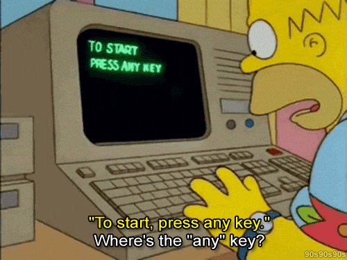

## 👋 Hi there, I'm Aadya
 
 
- 🌱 I’m currently a senior at Purdue University double majoring in Computer Science and AI with a minor in Psychology & Critical Disability Studies alongside certifications in Data Science and Entrepreneurship
- 👀 I’m interested in SWE, TPM, PM & Technical consulting roles
- 🔭 I’m currently working on an ML prediction model for cricket player performance
- 🌱 I’m currently learning SQL
- 🤔 I’m looking for help with internships and job search
- 📫 How to reach me: pawar17@purdue.edu
- 😄 Pronouns: she/her
- 🤖 I have two GitHub accounts, this one and [@Aadya7104](https://github.com/aadya7104). I work mainly on the other account since I have access to GitHub Education perks through my school on it.

<!--
**pawar17/pawar17** is a ✨ _special_ ✨ repository because its `README.md` (this file) appears on your GitHub profile.

Here are some ideas to get you started:

-->
